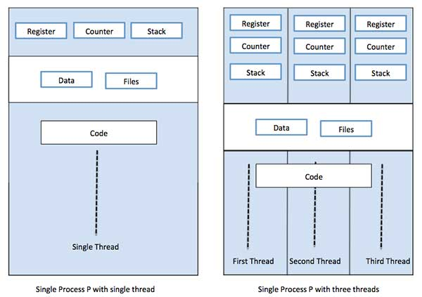
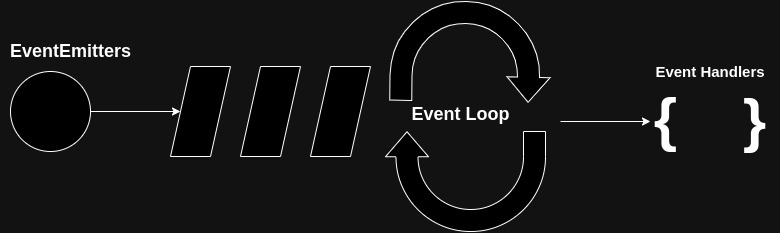

# Processes and Event Driven Programming

## Processes

- Process can create, manage a threads.

- Are not bound to single CPU core.

- Process contains one main primary thread and can spawn multiple sub threads, containing their own set of registers and a stack. Hence can become multithreaded.

- All processes provides resources to execute a program.

> In the figure above, we have a process, a left one with a single thread, right one with multiple threads.

## Properties of Process incluces:

- Process ID

- Process Group ID

- User ID

- Process Group ID

- Environment

- Stack

- Register

- Heap

- File Descriptors

- Signal actions

- Shared libraries

- Inter process communication tools (message queues, semaphores, ...)

## Advantages:

- Can make use of multi-core processors.

- Better at handling CPU intensive tasks

- Overcomes limitations of GIL by spawning multiple processes.

- Crashing a process doesnt kills a whole program.

## Disadvantages:

- No shared resources between processes

- We have to implement our own IPC (inter process communication) primitives

## Example:

- Click on an icon on your desktop.

- Operating system registers it as an event.

- Performs action related to that specific style of event.

- Trigger callbacks:
    - Interaction is characterized as an event or a series of event.

# Event Driven Programs

