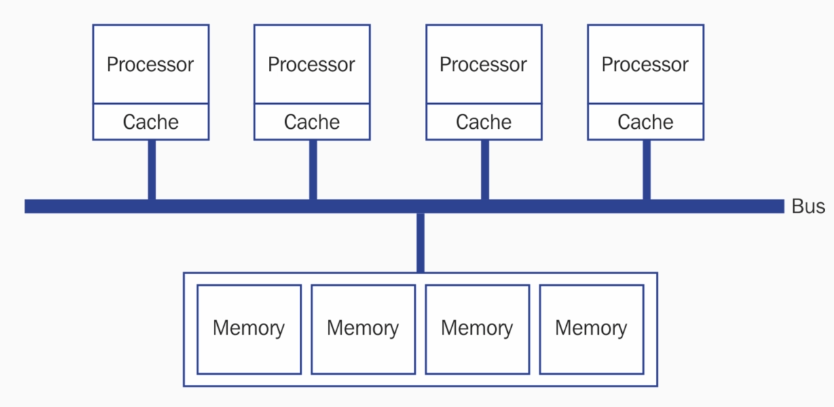
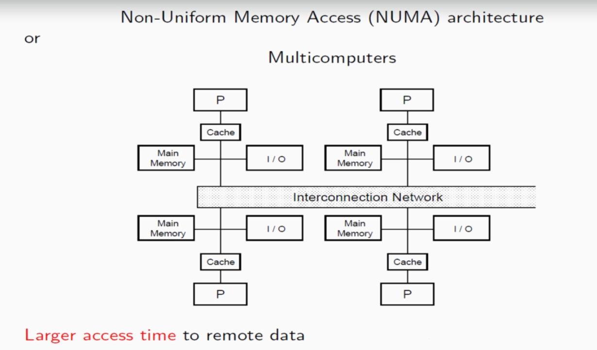

# Computer Memory Architecture Styles

**Different Architectural Styles:**

- Uniform Memory Access Pattern (UMA)

- Non-Uniform Memory Access (NUMA)

## Uniform Memory Access Pattern

- Shared memory space:
    - Utilized in a uniform manner

    - By any number of processing cores

- Also known as Symmetric Shared-Memory Multiprocessor (SMP)

In this architectural style, each processor in interfaced to the bus to access the shared memory space. Every addition in the number of processor increases the bus bandwidth. Basically bus is an interface to perform any IO on memory.

**Advantages:**

- All RAM access takes same amount of time.

- Cache is coherent and consistent.

- Hardware design is simpler.

**Disadvantages:**

- Feature one memory bus from which all system access memory.

- Presents scaling problem.

## Non-Uniform Memory Access (NUMA)

- Architectural style - memory access faster than others:
    - Depending on the processor

    - Due to location of processor with respect to memory.

In this architectural style, each has its own cache, memory and I/O and each one is connected to interconnection network.

**Advantages:**

- Machines are more scalable.

**Disadvantages:**

- Non-deterministic memory (memory location is not pre determined) - quick access time or larger access time.

