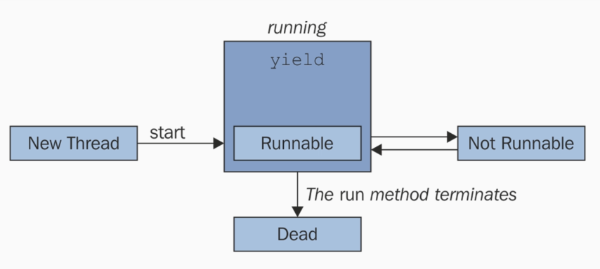

# Threads in Python

Python threads module imported from: ``threading.Thread``

**Constructor Params:**

```py
class Thread:
    """A class that represents a thread of control.

    This class can be safely subclassed in a limited fashion. There are two ways
    to specify the activity: by passing a callable object to the constructor, or
    by overriding the run() method in a subclass.

    """

    _initialized = False

    def __init__(self, group=None, target=None, name=None,
                 args=(), kwargs=None, *, daemon=None):
        """This constructor should always be called with keyword arguments. Arguments are:

        *group* should be None; reserved for future extension when a ThreadGroup
        class is implemented.

        *target* is the callable object to be invoked by the run()
        method. Defaults to None, meaning nothing is called.

        *name* is the thread name. By default, a unique name is constructed of
        the form "Thread-N" where N is a small decimal number.

        *args* is a list or tuple of arguments for the target invocation. Defaults to ().

        *kwargs* is a dictionary of keyword arguments for the target
        invocation. Defaults to {}.

        If a subclass overrides the constructor, it must make sure to invoke
        the base class constructor (Thread.__init__()) before doing anything
        else to the thread.

        """
```

**States:**
- Running
- Not Running
- Runnable
- Starting
- Ended

Whern we **create a thread**, thre is **no any allocated resources** for the thread, so it exists in **no state(not initialized)** and it can only be started or stopped.


## Thread Transition State:



- In the **New Thread** State, it hasnt been started or allocated.

- In the **Runnable** state, it is waiting to run. It has all the resources to procede, only thing that's holding back is the task scheduler not scheduling it yet to run.

- In the **runing** has been choosen by the task scheduler, making progress. From this state it could go into **Dead State** or **Not Running** state.

- In the **Not Runing** state, it could be because of waiting for some resources (some long runing I/O request) or could be blocked untill the other thread completes execution. (may be due to locks)

- In the **Dead** state, it might have been killed or unexpectedly terminated.


**State transition with Code:**

```py
import threading

import time

def threadWorker():
    # it is the only at the point where the thread starts
    # here it goes from runnable to runing state

    print("Thread has entered the runing state")

    # if we perform some waiting, goes into not-runnable state.
    time.sleep(5)

    # Entered into the runing state again
    print("Thread ws paused and again entered the runing state")

    # nothing further to procede with, dead now

# at this point, thread has no state,hasn't been allocated any resources
myThread = threading.Thread(target=threadWorker)

# call to .start() method allocates the necessary resources in order
# for threads to run
# Note that Here, it goes from Starting to Runnable state but not runing
# only goes into runing state when target function is invoked
myThread.start()

# here we join the thread to our main process,
myThread.join()

```
