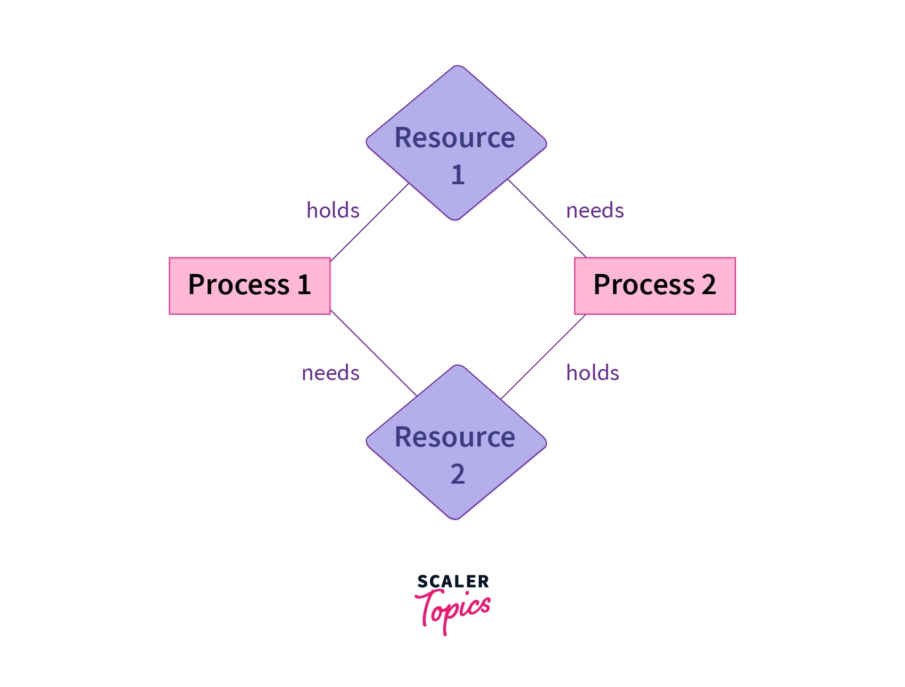

# DeadLock and Race Condition:

## Deadlock

Processes need various resources like the CPU, file storage, and I/O devices to complete their tasks. After a process finishes its execution, it releases the resources it was using. However, when multiple processes run simultaneously, they often compete for the same resources required for execution, potentially leading to deadlock.

A deadlock occurs when two or more processes become stuck, each holding a resource while waiting for another resource that is currently held by another process. As a result, none of the processes can continue executing.

[Readmore...](https://www.geeksforgeeks.org/introduction-of-deadlock-in-operating-system/)

**Necessary Conditions for Deadlock:**

- **Mutual Exclusion:** Only one process can use a resource at any given time i.e. the resources are non-sharable.

- **Hold and wait:** A process is holding at least one resource at a time and is waiting to acquire other resources held by some other process.

- **No preemption:** The resource can be released by a process voluntarily i.e. after execution of the process.

- **Circular Wait:** A set of processes are waiting for each other in a circular fashion. For example, lets say there are a set of processes {P0, P1, P2, P3} such that P0 depends on P1, P1 depends on P2, P2 depends on P3, P3 depends on P0. This creates a circular relation between all these processes and they have to wait forever to be executed. Here dependency is on waiting to release some acquired resource by the process.

**Example of Deadlock:**

In the illustration above:
- **Two Process:** Process1 and Process2
- **Two Resource:** Resource1 and Resource2.
- Each process requires both resources to procede.
- But, each one of resource is being held by a process.
- i.e. resource1 by process1 and resource2 by process2.

DeadLock Prevention: [Bankers' Algorithm](https://www.geeksforgeeks.org/deadlock-prevention/)

## Race Condition:

A situation in which multiple threads or processes read and write a shared data item and the final result depends on relative timing of their execution.

This occurs when the runing thread acts upon a critical section in a code concurrently modifying a part of code which is used to modify or read the shared data resource. [Read more](https://www.javatpoint.com/race-condition-in-operating-system)

